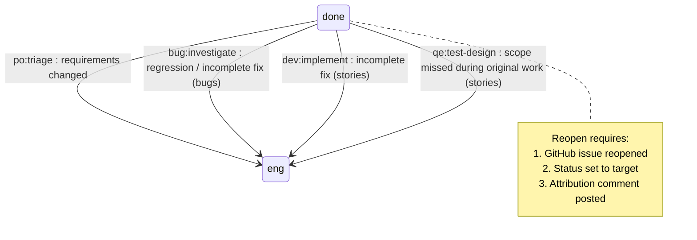

# Design: Reopen Workflow for Issues

**Epic:** #75 — Reopen Workflow for Issues
**Date:** 2026-05-14
**Project:** botminter

---

## Overview

### Problem

When an issue reaches `done` and is closed, there is no defined path for reopening it. Regressions, incomplete fixes, or new information can require an issue to re-enter the pipeline, but today the team has no convention for:

- Who decides to reopen an issue
- What status a reopened issue transitions to
- How to preserve the original resolution context
- How the board scanner detects and dispatches reopened issues

The existing rejection loops in PROCESS.md only cover in-flight issues (e.g., `eng:qe:verify` back to `eng:dev:implement`). Once an issue is closed and at `done`, there is no re-entry point.

### Solution

Define a reopen workflow that integrates into the existing status graph. A reopened issue re-enters the pipeline at one of three target statuses depending on the reason for reopening. The `close-reopen.sh` script is extended to accept a `--target-status` parameter, and the board scanner treats reopened issues identically to any other issue at its assigned status — no new scanner logic is required.

### Scope

- Define reopen triggers and target statuses in PROCESS.md
- Define the comment convention for reopen attribution
- Extend `close-reopen.sh` to optionally set a target status on reopen
- Document interaction with epics, stories, and bugs

### Out of Scope

- Automated regression detection (detecting that a fix broke)
- New board statuses — the reopen workflow uses existing statuses
- Changes to the board scanner dispatch tables
- Changes to the sentinel merge gate
- Automated linking between a reopened issue and the regression trigger

---

## Architecture

### Reopen as a Status Graph Re-Entry

The reopen workflow does not add new statuses. Instead, it defines a re-entry edge from `done` (terminal) back into the existing status graph at one of three target statuses, depending on the reason for reopening.



### Trigger Model

A reopen is always a **deliberate human or agent action**, not an automatic detection. The trigger is a two-step operation:

1. **Reopen the GitHub issue** (changes state from `closed` to `open`)
2. **Set the project board status** to the appropriate target

Both steps are performed via the `close-reopen.sh` script (extended with `--target-status`). Without step 2, the reopened issue has no status and the board scanner will not pick it up.

### Who Can Reopen

Any hat or human that identifies the need for rework:

| Actor | Typical Scenario |
|-------|-----------------|
| **Human (PO)** | Requirements changed, acceptance was premature |
| **QE (qe_verifier / qe_investigator)** | Regression discovered during later verification |
| **Dev (dev_implementer)** | Incomplete fix discovered during later story work |
| **Architect (arch_monitor)** | Epic-level regression detected during monitoring |

The actor reopening the issue MUST post an attribution comment explaining the reason.

### Target Status by Reason

| Reason | Issue Type | Target Status | Rationale |
|--------|-----------|---------------|-----------|
| Requirements changed | Epic | `eng:po:triage` | Needs full re-evaluation |
| Requirements changed | Story | `eng:po:triage` | Needs re-scoping |
| Requirements changed | Bug | `eng:po:triage` | Needs re-evaluation |
| Regression discovered | Bug | `eng:bug:investigate` | QE must reproduce and analyze the regression |
| Incomplete fix (simple) | Story | `eng:dev:implement` | Known scope — go straight to implementation |
| Incomplete fix (complex) | Story | `eng:qe:test-design` | Needs new test coverage for missed scope |
| Incomplete fix | Bug (simple) | `eng:bug:investigate` | Re-investigate to understand what was missed |
| Incomplete fix | Bug (complex) | `eng:bug:in-progress` | Subtasks may need additions |

**Default rule:** When in doubt, reopen to `eng:po:triage`. It is safer to re-triage than to skip evaluation.

### Epic Reopen Behavior

When an epic is reopened:

- The epic itself moves to the target status (usually `eng:po:triage`)
- Existing stories under the epic are NOT automatically reopened
- If specific stories need rework, they are reopened individually
- If new stories are needed, they are created through the normal `eng:arch:breakdown` flow after the epic progresses through design/planning again

### History Preservation

Reopened issues MUST preserve all existing context:

- **No clearing of comments** — all prior work, reviews, and decisions remain
- **No clearing of labels** — existing labels are preserved; a `reopen` label is NOT required (the comment trail provides audit)
- **No clearing of milestone** — the issue stays in its milestone (the PO can reassign if needed)
- **PR history** — merged PRs from the original resolution remain merged. New work creates new PRs on new branches

The reopen attribution comment (see Comment Convention below) provides a clear marker in the issue timeline separating the original resolution from the rework.

---

## Components and Interfaces

### Component 1: PROCESS.md Update

Add a new "Reopen Workflow" section to PROCESS.md documenting:

- The reopen trigger model (two-step: reopen issue + set status)
- The target status table
- The comment convention
- The history preservation rules

This is the authoritative reference. All other changes implement what PROCESS.md defines.

### Component 2: `close-reopen.sh` Extension

**File:** `team/coding-agent/skills/github-project/scripts/close-reopen.sh`

**Current interface:**

```bash
close-reopen.sh --issue <number> --action <close|reopen>
```

**Extended interface:**

```bash
close-reopen.sh --issue <number> --action <close|reopen> [--target-status <status>]
```

When `--action reopen` is used with `--target-status`:

1. Reopen the GitHub issue (`gh issue reopen`)
2. Look up the project item ID for the issue
3. Look up the option ID for the target status
4. Set the status via `gh project item-edit`
5. Post an auto-transition comment noting the reopen and target status

When `--target-status` is omitted on reopen, the issue is reopened but no status is set. This preserves backward compatibility but means the board scanner will not pick it up until a status is manually assigned.

**Validation:** The script validates that `--target-status` is only used with `--action reopen`. Using it with `--action close` is an error.

### Component 3: Comment Convention

Reopen comments use the standard format with the acting persona:

```markdown
### <emoji> <persona> — <ISO-8601-UTC-timestamp>

**Reopened** — <reason category>

<explanation of why the issue is being reopened, with links to the
regression, new information, or incomplete scope>

**Target status:** `<target-status>`
**Original resolution:** <date or link to the closing comment>
```

Example:

```markdown
### 🧪 qe — 2026-05-14T10:30:00Z

**Reopened** — regression discovered

Story #42 introduced a regression in the authentication flow. The session
handler now fails when the user has multiple active sessions. See #88
for the regression report.

**Target status:** `eng:bug:investigate`
**Original resolution:** 2026-05-10T14:00:00Z
```

### Component 4: Board Scanner Behavior

**No changes required.** The board scanner dispatches based on the status field value, not on whether an issue was previously closed. Once a reopened issue has its status set (via `close-reopen.sh --target-status`), the scanner picks it up on the next scan cycle and dispatches to the appropriate hat, exactly as it would for any other issue at that status.

The scanner already skips `done` and `error` statuses. A reopened issue at `done` (status not yet changed) is skipped — this is correct behavior. The status must be explicitly set to a non-terminal value for the scanner to act on it.

---

## Acceptance Criteria

### AC1: PROCESS.md documents the reopen workflow

**Given** the current PROCESS.md has no reopen workflow section
**When** the epic is implemented
**Then** PROCESS.md contains a "Reopen Workflow" section that documents:
  - The two-step trigger model (reopen + set status)
  - The target status table (reason x issue type -> status)
  - The comment convention with example
  - The history preservation rules
  - The default rule ("when in doubt, reopen to `eng:po:triage`")

### AC2: `close-reopen.sh` accepts `--target-status` on reopen

**Given** an issue at status `done` that is closed
**When** `close-reopen.sh --issue 42 --action reopen --target-status eng:dev:implement` is run
**Then** the issue is reopened AND its project board status is set to `eng:dev:implement`

### AC3: `close-reopen.sh` rejects `--target-status` on close

**Given** an open issue
**When** `close-reopen.sh --issue 42 --action close --target-status eng:dev:implement` is run
**Then** the script exits with an error message indicating `--target-status` is only valid with `--action reopen`

### AC4: `close-reopen.sh` backward compatibility preserved

**Given** an issue at status `done` that is closed
**When** `close-reopen.sh --issue 42 --action reopen` is run (no `--target-status`)
**Then** the issue is reopened but no status change is made (existing behavior)

### AC5: Board scanner picks up reopened issues

**Given** a closed issue at status `done`
**When** the issue is reopened and its status is set to `eng:bug:investigate`
**Then** on the next board scan cycle, the scanner dispatches the issue to the `qe.investigate` event, identical to a newly created bug at that status

### AC6: Reopen attribution comment is posted

**Given** an issue being reopened
**When** the reopen is performed (via script or manually)
**Then** a comment following the standard format is posted on the issue, including:
  - The reason category (regression, incomplete fix, requirements changed)
  - An explanation linking to the trigger
  - The target status
  - Reference to the original resolution

### AC7: Epic reopen does not cascade to stories

**Given** a completed epic with three completed stories
**When** the epic is reopened to `eng:po:triage`
**Then** the three stories remain at `done` and closed; only the epic re-enters the pipeline

---

## Impact on Existing System

### PROCESS.md

A new section is added. No existing sections are modified. The new section references existing statuses and follows established conventions.

### `close-reopen.sh`

One new optional parameter (`--target-status`) is added. The existing `--issue` and `--action` parameters are unchanged. The script's behavior without `--target-status` is identical to current behavior.

### Board Scanner

No changes. The scanner already dispatches by status value. Reopened issues at valid statuses are handled identically to newly created issues at those statuses.

### Status Field

No new status options are added. The reopen workflow reuses existing statuses (`eng:po:triage`, `eng:bug:investigate`, `eng:dev:implement`, `eng:qe:test-design`, `eng:bug:in-progress`).

### Comment History

Reopened issues accumulate additional comments. The reopen attribution comment provides a clear timeline marker. No existing comments are modified or deleted.

### Behavioral Changes

| Scenario | Before | After |
|----------|--------|-------|
| Issue at `done` needs rework | No defined process; ad-hoc | Defined reopen flow with target status and attribution |
| `close-reopen.sh --action reopen` | Reopens issue only | Reopens issue only (unchanged) |
| `close-reopen.sh --action reopen --target-status X` | N/A (parameter not supported) | Reopens issue and sets status to X |
| Board scan finds reopened issue at `eng:dev:implement` | Dispatches normally | Dispatches normally (unchanged) |

### Blast Radius

| Change | Files | Nature |
|--------|-------|--------|
| PROCESS.md update | 1 file | Documentation — new section |
| `close-reopen.sh` extension | 1 file | Additive — new optional parameter |

No interface changes to other scripts, no new dependencies, no configuration changes.

---

## Security Considerations

### Access Control

The reopen operation uses existing GitHub permissions. Only users with write access to the repository can reopen issues and modify project board fields. No new permissions are required.

### Audit Trail

The mandatory reopen attribution comment provides an audit trail for why an issue was reopened, who reopened it, and what the target status is. This is append-only — existing comments are never modified.

### No New Attack Surface

- No new API endpoints or scripts (only an extension to an existing script)
- No new configuration inputs beyond the existing status field values
- No credential handling changes
- The `--target-status` parameter is validated against existing status options; arbitrary values are rejected by the GitHub Projects API
