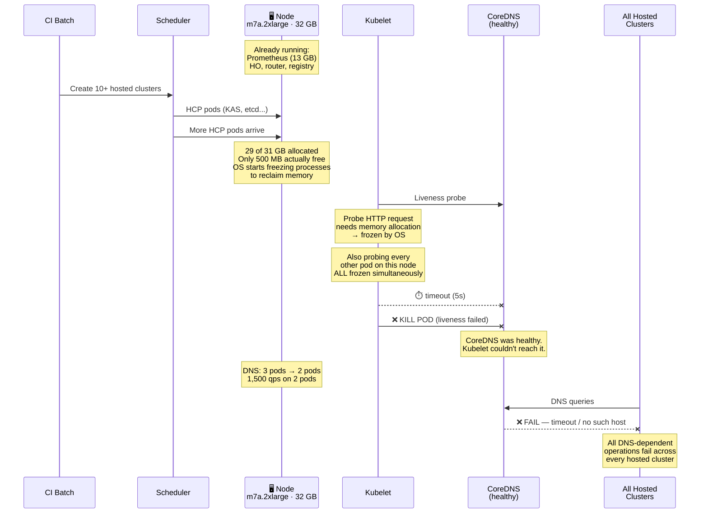

# Root Cause Analysis: HyperShift Mass CI Test Failures

**JIRA:** [OCPBUGS-82112](https://redhat.atlassian.net/browse/OCPBUGS-82112)  
**Management Cluster:** `hypershift-ci-3` (ROSA, us-east-1)  
**Report Date:** 2026-04-21

---

## TL;DR

### Root Cause

The management cluster (`hypershift-ci-3`) has two NodePools:

- **`ci`** — m7a.4xlarge (64 GB), tainted `NoSchedule` for hosted cluster control planes
- **`workers`** — m7a.2xlarge (32 GB), **untainted** — all cluster infrastructure lands here

Two compounding problems:
- **Sizing:** Prometheus alone consumes 8–15 GB on a 32 GB node, leaving little room for anything else. Even without HCP spillover, infra can reach ~18 GB — over half the node.
- **Scheduling:** The taint blocks infra from `ci` nodes, but nothing blocks HCP pods from `workers` nodes. When HCP pods spill onto `workers`, they compete with an already memory-heavy infra stack for the remaining headroom.

### What Happens Under CI Load

- CI batch creates 10+ hosted clusters simultaneously
- Scheduler spreads HCP pods across **all** eligible nodes, including all 3 `workers`
- Memory requests hit 29 of 31 GB allocatable on each `workers` node
- MemFree drops to ~500 MB — the OS freezes all processes to reclaim pages
- Kubelet can't execute liveness probes for **any** pod on the node
- CoreDNS gets killed despite being healthy

### Thundering Herd

This isn't a single-node failure. The same CI batch overwhelms all 3 `workers` nodes at once:
- **2 of 3 DNS pods down simultaneously** at 01:54, 02:23, 02:36, 02:38 UTC
- A single DNS pod served the entire management cluster at those moments
- DNS was degraded (2 or fewer pods) for **over 2 hours** (00:34–02:46)
- If scheduling had been slightly different, all 3 could have failed — **total DNS blackout**



**Not a HyperShift code bug.** CI infrastructure taint/sizing issue.

### How We Got the Data

We had a kubeconfig for the management cluster (`hypershift-ci-3`) and used three data sources:

1. **Prometheus/Thanos** on the management cluster — memory metrics, pod counts, DNS query rates, kubelet probe failure counters (`prober_probe_total`), memory request totals (`kube_pod_container_resource_requests`). Retention starts Apr 20 18:04 UTC.
2. **`oc debug node`** — non-interactive shell into each node to read kernel counters (`/proc/vmstat`, `/proc/meminfo`), `dmesg`, and `journalctl -u kubelet`.
3. **Prow job artifacts** — build logs and dump archives from GCS (`test-platform-results` bucket), accessed via HTTPS.

All commands are included in collapsible sections throughout the report.

### Consistent Across Every Job We Checked

Same management cluster, different jobs, different OCP versions, different dates, different DNS error messages — **same pattern every time**: node memory exhaustion → CoreDNS killed → DNS-dependent operations fail.

| Job | OCP | Date | DNS Symptom | Failures |
|-----|-----|------|-------------|----------|
| [4.22 #...130368](https://prow.ci.openshift.org/view/gs/test-platform-results/logs/aggregated-hypershift-ovn-conformance-4.22-release-openshift-release-analysis-aggregator/2046359024563130368) | 4.22 | Apr 20–21 | kube-api disruption (5/10 runs) | 6 |
| [5.0 #...769600](https://prow.ci.openshift.org/view/gs/test-platform-results/logs/aggregated-hypershift-ovn-conformance-5.0-release-openshift-release-analysis-aggregator/2046376312783769600) | **5.0** | Apr 20–21 | `konnectivity-server-local: no such host` ×1,304 | **467** |
| [4.22 #...243968](https://prow.ci.openshift.org/view/gs/test-platform-results/logs/aggregated-hypershift-ovn-conformance-4.22-release-openshift-release-analysis-aggregator/2046459091324243968) | 4.22 | Apr 21 | `konnectivity-server-local: no such host` | 4 |
| [4.22 #...750976](https://prow.ci.openshift.org/view/gs/test-platform-results/logs/aggregated-hypershift-ovn-conformance-4.22-release-openshift-release-analysis-aggregator/2044995175322750976) | 4.22 | Apr 17 | `read udp→172.30.0.10:53: i/o timeout` + etcd leader churn | 3 |

The DNS error varies — `no such host`, `i/o timeout`, API disruption — because different operations hit DNS at different moments during the outage. The underlying cause is always the same: CoreDNS pod killed by liveness probe timeout on a memory-exhausted node. Severity tracks how much memory pressure the node was under when each job ran, not the OCP version or test content.

---

## 1. Management Cluster Architecture

### The Taint Design

```
m7a.4xlarge (64 GB) — TAINTED               m7a.2xlarge (32 GB) — UNTAINTED
┌──────────────────────────────┐          ┌──────────────────────────────┐
│ hypershift.openshift.io/     │          │                              │
│   control-plane:NoSchedule   │          │ Prometheus        8–15 GB   │
│                              │          │ HyperShift Operator 0.1–1 GB│
│ ✅ HCP pods (have toleration)│          │ kube-state-metrics   350 MB │
│ ❌ Prometheus                │          │ CoreDNS, Router, Registry   │
│ ❌ CoreDNS                   │          │ Alertmanager, Thanos        │
│ ❌ Router, Registry          │          │                              │
│ ❌ HyperShift Operator       │          │ ✅ HCP pods ALSO land here  │
│                              │          │    (taint doesn't block this)│
│ 5 nodes, well-provisioned    │          │                              │
│ Up to 322 pods, zero issues  │          │ 3 nodes, structurally starved│
└──────────────────────────────┘          └──────────────────────────────┘
```

The taint blocks **infra from going to 4xlarge** but does NOT block **HCP from going to 2xlarge**. The untainted nodes get hit from both sides.

<details><summary>Commands: taint and toleration inspection</summary>

```bash
# Node taints
for node in $(KUBECONFIG=<path-to-kubeconfig> oc get nodes -o jsonpath='{.items[*].metadata.name}'); do
  taints=$(KUBECONFIG=<path-to-kubeconfig> oc get node $node -o jsonpath='{.spec.taints}')
  type=$(KUBECONFIG=<path-to-kubeconfig> oc get node $node -o jsonpath='{.metadata.labels.node\.kubernetes\.io/instance-type}')
  echo "$node ($type): taints=${taints:-<none>}"
done

# Prometheus tolerations
KUBECONFIG=<path-to-kubeconfig> oc get pod prometheus-k8s-0 -n openshift-monitoring -o jsonpath='{.spec.tolerations}'

# CoreDNS tolerations
KUBECONFIG=<path-to-kubeconfig> oc get pod dns-default-kfhmt -n openshift-dns -o jsonpath='{.spec.tolerations}'
```
</details>

### Node Inventory

Two ROSA NodePools:

| NodePool | Type | RAM | Tainted | Nodes | Scales? |
|----------|------|-----|---------|-------|---------|
| **`hypershift-ci-3-workers`** | m7a.2xlarge | 32 GB | No | 3 (one per AZ) | No — static minimum |
| **`hypershift-ci-3-ci`** | m7a.4xlarge | 64 GB | Yes | 5–8 | Yes — autoscaler |

| Node | NodePool | AZ |
|------|----------|----|
| ip-10-0-135-91 | `workers` | us-east-1a |
| ip-10-0-153-209 | `workers` | us-east-1b |
| ip-10-0-171-26 | `workers` | us-east-1c |
| ip-10-0-137-180 | `ci` | us-east-1a |
| ip-10-0-157-94 | `ci` | us-east-1b |
| ip-10-0-158-179 | `ci` | us-east-1b |
| ip-10-0-160-247 | `ci` | us-east-1c |
| ip-10-0-164-186 | `ci` | us-east-1c |

The `workers` pool never scales down. The `ci` pool scales with demand (8 nodes on Apr 17, 5 on Apr 21).

### DNS Topology

3 CoreDNS pods (DaemonSet), one per untainted node, serving 172.30.0.10. All DNS for the management cluster goes through these 3 pods. Baseline load: ~1,500 qps, 74% NXDOMAIN from `ndots:5` search path walks.

<details><summary>Commands: DNS topology and query rates</summary>

```bash
# DNS pods and placement
KUBECONFIG=<path-to-kubeconfig> oc get pods -n openshift-dns -o wide

# DNS query rate by response code
curl -sk -H "Authorization: Bearer $TOKEN" \
  "${THANOS}/api/v1/query" \
  --data-urlencode 'query=sum by (rcode)(rate(coredns_dns_responses_total[5m]))'

# KAS resolv.conf (ndots:5 confirmation)
KUBECONFIG=<path-to-kubeconfig> oc exec -n clusters-<hcp-ns> <kas-pod> \
  -c kube-apiserver -- cat /etc/resolv.conf
```
</details>

---

## 2. What Happens Under CI Load

When a CI batch creates 10+ hosted clusters, HCP pods (KAS, etcd, controllers) schedule across the cluster. The 4xlarge nodes absorb most of them (they have the toleration), but pods also spill onto the untainted 2xlarge nodes. Combined with the infra workload already there, total memory requests approach the node's allocatable capacity.

### Memory State at Failure

At each failure point, the node that fails has ~29 GB of memory requests against 31 GB allocatable. Actual memory breakdown:

```
Node allocatable:                31.0 GB
Pod memory requests:            ~29.0 GB   (infra + HCP spillover)
─────────────────────────────────────────
Remaining allocatable:           ~2.0 GB

Actual state (/proc/meminfo):
  MemTotal:                      30.7 GB
  Used (non-reclaimable):        26.8 GB
  Cached (reclaimable):           3.6 GB
  MemFree (actual free pages):    0.5 GB   ← this is the real number
  MemAvailable:                   3.9 GB   ← misleading; includes cache
```

At **500 MB actual free pages**, the kernel enters direct reclaim.

<details><summary>Commands: memory state and requests</summary>

```bash
# Memory breakdown on a node at a specific time
curl -sk -H "Authorization: Bearer $TOKEN" "${THANOS}/api/v1/query" \
  --data-urlencode 'query={__name__=~"node_memory_MemTotal_bytes|node_memory_MemFree_bytes|node_memory_MemAvailable_bytes|node_memory_Cached_bytes",instance=~".*171-26.*"}' \
  --data-urlencode 'time=2026-04-21T00:45:00Z'

# Total memory requests per node at a point in time
curl -sk -H "Authorization: Bearer $TOKEN" "${THANOS}/api/v1/query" \
  --data-urlencode 'query=sum by (node)(kube_pod_container_resource_requests{resource="memory", node=~"ip-10-0-135-91.*|ip-10-0-153-209.*|ip-10-0-171-26.*"}) / 1024 / 1024 / 1024' \
  --data-urlencode 'time=2026-04-21T00:48:00Z'
```
</details>

---

## 3. The Kernel Mechanism

With 500 MB MemFree, any process that allocates memory triggers **direct reclaim** — the kernel synchronously scans and evicts pages before returning the allocation. The calling process is frozen until a page is freed.

Evidence from `vmstat` on `ip-10-0-135-91`:

| Counter | Value | Meaning |
|---------|-------|---------|
| `allocstall_normal` | 2,812 | Direct reclaim stalls (process frozen waiting for memory) |
| `allocstall_movable` | 17,934 | More stalls in the movable zone |
| `pgsteal_direct` | 1,119,809 | Pages stolen synchronously by blocked processes |
| `pgscan_direct` | 1,485,262 | Pages scanned during direct reclaim |
| `pgmajfault` | 16,714,123 | Major page faults (had to read from disk) |
| `compact_stall` | 7,979 | Memory compaction stalls |

**20,746 `allocstall` events** = 20,746 times a process was frozen waiting for the kernel to free memory. The kubelet's probe goroutines are among those frozen processes.

<details><summary>Commands: kernel vmstat counters</summary>

```bash
oc debug node/ip-10-0-135-91.ec2.internal -- chroot /host bash -c '
  grep -E "allocstall|pgsteal_direct|pgscan_direct|pgmajfault|compact_stall" /proc/vmstat
  echo "---"
  grep -E "MemTotal|MemFree|MemAvailable|Cached|SReclaimable" /proc/meminfo
'
```
</details>

### What the Kubelet Sees

Kubelet logs from `ip-10-0-135-91` at 01:38:29–01:38:34 UTC show **every pod on the node** failing probes within a 5-second window:

```
01:38:29  CSI driver:          "context deadline exceeded"
01:38:30  HCP controller-mgr:  "context deadline exceeded"
01:38:30  konnectivity-agent:  "context deadline exceeded"
01:38:30  external-dns:        "context deadline exceeded"
01:38:30  CoreDNS (readiness): "context deadline exceeded"
01:38:30  console:             "request canceled while waiting for connection"
01:38:31  Prometheus:          "command timed out"
01:38:32  CoreDNS (liveness):  "context deadline exceeded"  → KILLED
01:38:33  Prometheus:          "command timed out"           → KILLED
```

CoreDNS was healthy. The kubelet couldn't reach it because its HTTP client was frozen waiting for a page allocation. After enough consecutive liveness failures, the kubelet kills CoreDNS. Then DNS capacity drops and downstream failures cascade.

<details><summary>Commands: kubelet probe logs</summary>

```bash
oc debug node/ip-10-0-135-91.ec2.internal -- chroot /host \
  journalctl -u kubelet --since "2026-04-21 01:38" --until "2026-04-21 01:39" \
  | grep -iE "probe|liveness|dns-default"
```
</details>

---

## 4. Evidence: Every Failure Follows This Pattern

Using `prober_probe_total{result="failed", probe_type="Liveness"}` and `node_memory_MemAvailable_bytes` from the management cluster's Prometheus, we correlated every DNS probe failure with node memory state.

### 6 DNS Failure Events Across 3 Jobs

| # | Time | Failing Node | Requests/Alloc | MemFree | Other Nodes |
|---|------|-------------|----------------|---------|-------------|
| 1 | 00:48 | 171-26 | 28.8/31 GB | **0.5 GB** (MemAvail 4.0) | 135-91: 6.2, 153-209: 16.4 |
| 2 | 01:55 | 135-91 | 28.1/31 GB | **(scrape failed)** | 171-26: 7.8, 153-209: 19.0 |
| 3 | 02:23 | 135-91 | —/31 GB | **(scrape failed)** | 171-26: 6.4, 153-209: 20.1 |
| 4 | 02:45 | 171-26 | —/31 GB | **~0.5 GB** (MemAvail 4.5) | 135-91: 6.7, 153-209: 17.3 |
| 5 | 05:46 | 171-26 | 28.1/31 GB | **~0.5 GB** (MemAvail 4.2) | 135-91: 11.3, 153-209: 18.9 |
| 6 | 05:51 | 171-26 | —/31 GB | **~0.5 GB** (MemAvail ~4) | 135-91: 10.6, 153-209: 17.7 |

The failure **rotates** between `ip-10-0-135-91` and `ip-10-0-171-26` depending on which has more HCP pods at that moment. `ip-10-0-153-209` never fails — it consistently has 2–4x more headroom (fewer pods scheduled there). It's not one "sick node"; it's whichever node the scheduler loaded most heavily.

<details><summary>Commands: probe failures and memory correlation</summary>

```bash
# DNS liveness probe failures at 1-minute resolution
curl -sk -H "Authorization: Bearer $TOKEN" "${THANOS}/api/v1/query_range" \
  --data-urlencode 'query=rate(prober_probe_total{result="failed", pod=~"dns-default.*", probe_type="Liveness"}[1m]) > 0' \
  --data-urlencode 'start=2026-04-20T22:00:00Z' \
  --data-urlencode 'end=2026-04-21T07:00:00Z' \
  --data-urlencode 'step=60'

# Memory available on all 3 untainted nodes at a failure timestamp
curl -sk -H "Authorization: Bearer $TOKEN" "${THANOS}/api/v1/query" \
  --data-urlencode 'query=node_memory_MemAvailable_bytes{instance=~".*135-91.*|.*153-209.*|.*171-26.*"} / 1024 / 1024 / 1024' \
  --data-urlencode 'time=2026-04-21T00:48:00Z'

# Memory requests on all 3 untainted nodes at same timestamp
curl -sk -H "Authorization: Bearer $TOKEN" "${THANOS}/api/v1/query" \
  --data-urlencode 'query=sum by (node)(kube_pod_container_resource_requests{resource="memory", node=~"ip-10-0-135-91.*|ip-10-0-153-209.*|ip-10-0-171-26.*"}) / 1024 / 1024 / 1024' \
  --data-urlencode 'time=2026-04-21T00:48:00Z'
```
</details>

### Thundering Herd: Multiple DNS Pods Down Simultaneously

The same CI batch hits all 3 `workers` nodes at once. At 4 points during the overnight window, **2 of 3 DNS pods were down simultaneously**:

| Time | DNS Pods Up | Implication |
|------|------------|-------------|
| 01:54 | **1** | Single pod serving entire cluster |
| 02:23 | **1** | Single pod serving entire cluster |
| 02:36 | **1** | Single pod serving entire cluster |
| 02:38 | **1** | Single pod serving entire cluster |
| 05:45–06:22 | 2 | Third node removed by autoscaler, never recovered |

From 00:34 to 02:46, DNS was degraded (2 or fewer pods) for over **2 hours**. This isn't an unlucky single-node failure — it's a systemic event where the same trigger overwhelms multiple nodes in the same pool simultaneously.

<details><summary>Commands: DNS pod availability</summary>

```bash
curl -sk -H "Authorization: Bearer $TOKEN" "${THANOS}/api/v1/query_range" \
  --data-urlencode 'query=count(up{job="dns-default", namespace="openshift-dns"} == 1)' \
  --data-urlencode 'start=2026-04-20T22:00:00Z' \
  --data-urlencode 'end=2026-04-21T07:00:00Z' \
  --data-urlencode 'step=60'
```
</details>

### Co-Failure of All Pods on the Node

The HyperShift operator replicas (also on untainted nodes, also don't tolerate the taint) fail probes at the **exact same times** as CoreDNS on the same node — confirming this is node-level, not pod-level:

| Time Window | Node | DNS probes fail | HO probes fail | Same node? |
|-------------|------|----------------|----------------|-----------|
| 00:36–00:55 | 171-26 | Yes | Yes | Yes |
| 01:41–02:41 | 135-91 | Yes | Yes | Yes |
| 02:41–02:50 | 171-26 | Yes | Yes | Yes |
| 05:45–06:05 | 171-26 | Yes | Yes | Yes |

---

## 5. Cross-Verification

Covered in the TL;DR table above. The key point: 4 different jobs across 2 OCP versions, all on the same management cluster, all fail with DNS resolution errors. The DNS error message varies (`no such host`, `i/o timeout`, API disruption) because different operations hit DNS at different points during the outage. The underlying cause — CoreDNS killed by probe timeout on a memory-exhausted node — is the same every time.

The 5.0 job is the most severe example — all 8 underlying runs affected, up to 1,304 DNS failures per run:

| Run | DNS Failures | Test Failures |
|-----|-------------|---------------|
| ...718400 | **1,304** | 332 |
| ...942208 | **630** | 538 |
| ...102784 | 242 | 236 |
| ...242304 | 163 | 431 |
| ...663808 | 129 | 34 |
| ...521216 | 93 | 460 |
| ...580736 | 88 | 368 |
| ...659904 | 12 | 8 |

---

## 6. Recommendations

### Primary Fix

**Upsize the `hypershift-ci-3-workers` NodePool from m7a.2xlarge (32 GB) to m7a.4xlarge (64 GB).** The `hypershift-ci-3-ci` nodes carry 300+ pods at 98% CPU with zero issues because 64 GB provides sufficient memory headroom. Giving the `workers` pool the same RAM eliminates the class of failures in this report.

### Alternative Fixes

**Prevent HCP pods from scheduling on untainted nodes.** The taint blocks infra from 4xlarge but not HCP from 2xlarge. Adding a complementary mechanism (taint on 2xlarge tolerated only by infra, or nodeAffinity on HCP pods requiring the 4xlarge taint) would keep HCP pods on the well-provisioned nodes. Note: this removes the ~6 GB HCP spillover but infra alone (Prometheus at 13 GB + monitoring stack + operators) already consumes ~18 GB on a 32 GB node. Prometheus growth during CI batches could still approach the threshold.

**Add memory limits to infra workloads.** Prometheus has no memory limit and grows unboundedly with scrape target count. Setting a limit would cap its impact — at the cost of OOM-killing Prometheus when it hits the limit, which has its own blast radius.

### Systemic Fix

**Review the taint/toleration design.** The current model creates two node classes: 4xlarge (HCP-only, tainted, well-provisioned) and 2xlarge (everything-else, untainted, undersized). All cluster infrastructure competes for the smallest nodes. This is structurally fragile.

### Monitoring

**Alert on `allocstall` rate or MemFree < 1 GB.** MemAvailable masks the real pressure — at 4 GB MemAvailable, actual MemFree is 500 MB and the kernel is already in direct reclaim. Early detection would allow draining nodes before probes start failing.

### Owner

**This is a CI infrastructure issue.** File against `hypershift-ci-3` management cluster configuration, not HyperShift product code.

---

## 7. Appendix

### Data Sources

| Source | Method |
|--------|--------|
| Node memory, pod counts | Prometheus/Thanos on `hypershift-ci-3` (retention from Apr 20 18:04) |
| Liveness probe failures | `prober_probe_total{result="failed", probe_type="Liveness"}` |
| Memory requests per node | `kube_pod_container_resource_requests{resource="memory"}` |
| DNS query rates | `coredns_dns_responses_total` by rcode |
| Kernel direct reclaim | `vmstat` counters via `oc debug node` |
| Kubelet probe logs | `journalctl -u kubelet` via `oc debug node` |
| Memory breakdown | `/proc/meminfo` via `oc debug node` |
| Node taints | `oc get nodes -o jsonpath` |
| KAS DNS config | `/etc/resolv.conf` in KAS pod (ndots:5, search clusters-xxx.svc.cluster.local) |
| Konnectivity Service | Verified present and correctly configured in HCP namespace dump |

### Analyzed Jobs

| Job | Build ID | Window |
|-----|----------|--------|
| aggregated-hypershift-ovn-conformance-4.22 | 2046359024563130368 | Apr 20 22:42–Apr 21 01:00 |
| aggregated-hypershift-ovn-conformance-5.0 | 2046376312783769600 | Apr 20 23:51–Apr 21 03:47 |
| aggregated-hypershift-ovn-conformance-4.22 | 2046459091324243968 | Apr 21 05:20–07:50 |

---

## 8. Deep Dive: Kernel Memory Reclaim and Kubelet Starvation

This section explains the low-level mechanism by which memory pressure translates into liveness probe failures. It is not required to understand the root cause — skip this unless you want to understand **why 500 MB MemFree kills liveness probes on an otherwise healthy node**.

### Why MemAvailable Is Misleading

At the moment before CoreDNS is killed, `/proc/meminfo` on the failing node shows:

```
MemTotal:        30.7 GB
MemFree:          0.5 GB   ← actual free pages
Cached:           3.6 GB   ← page cache (reclaimable in theory)
SReclaimable:     0.3 GB   ← slab cache (reclaimable)
MemAvailable:     3.9 GB   ← kernel's estimate of "usable" memory
```

`MemAvailable` (3.9 GB) looks fine. But it includes 3.6 GB of page cache that the kernel must **actively evict** before any process can use it. Evicting cache is not free — it requires scanning pages, writing dirty pages to disk, and updating page tables. At 500 MB MemFree, every new memory allocation triggers this eviction synchronously.

<details><summary>Commands: /proc/meminfo at failure time</summary>

```bash
# From Prometheus (at 00:45 UTC, just before failure on ip-10-0-171-26)
curl -sk -H "Authorization: Bearer $TOKEN" "${THANOS}/api/v1/query" \
  --data-urlencode 'query={__name__=~"node_memory_MemTotal_bytes|node_memory_MemFree_bytes|node_memory_MemAvailable_bytes|node_memory_Cached_bytes|node_memory_SReclaimable_bytes",instance=~".*171-26.*"}' \
  --data-urlencode 'time=2026-04-21T00:45:00Z'

# Live (current state)
oc debug node/ip-10-0-135-91.ec2.internal -- chroot /host \
  grep -E "MemTotal|MemFree|MemAvailable|Cached|SReclaimable" /proc/meminfo
```
</details>

### Direct Reclaim: When the Kernel Freezes Your Processes

When a process (including the kubelet) calls `malloc()` or opens a network socket, the kernel needs to provide free pages. If MemFree is exhausted, the kernel enters **direct reclaim** — the calling process is frozen while the kernel synchronously scans and evicts pages to free memory. The process cannot continue until a page is freed.

`/proc/vmstat` on `ip-10-0-135-91` shows the cumulative impact:

```
allocstall_normal    2,812     # process frozen waiting for a page (normal zone)
allocstall_movable  17,934     # same, movable zone
                   ──────
                   20,746 total stall events

pgsteal_direct    1,119,809    # pages forcibly reclaimed by blocked processes
pgscan_direct     1,485,262    # pages scanned to find reclaimable ones
pgmajfault       16,714,123    # page faults requiring disk I/O
compact_stall         7,979    # compaction stalls (defragmenting memory)
```

20,746 times a process was frozen waiting for memory. 1.1 million pages were stolen synchronously. Each stall can last milliseconds to seconds depending on how much scanning and I/O is required.

<details><summary>Commands: /proc/vmstat</summary>

```bash
oc debug node/ip-10-0-135-91.ec2.internal -- chroot /host bash -c '
  grep -E "allocstall|pgsteal_direct|pgscan_direct|pgmajfault|compact_stall" /proc/vmstat
'
```
</details>

### How This Kills Liveness Probes

The kubelet runs liveness probes on a timer. For HTTP probes, it opens a TCP connection to the pod's health endpoint and waits for a response. Each step — socket creation, TCP handshake, HTTP request — requires memory allocations. At 500 MB MemFree, each allocation risks hitting an `allocstall`:

1. Kubelet goroutine calls `net.Dial()` → needs socket buffer → **stalls 200ms** waiting for page eviction
2. TCP handshake needs more buffers → **stalls again**
3. Probe timeout (typically 1–5s) expires while the goroutine is frozen
4. Kubelet records `"context deadline exceeded"`
5. After `failureThreshold` consecutive failures → kubelet sends SIGKILL

The kubelet logs from 01:38:29–01:38:34 on `ip-10-0-135-91` show this happening to **every pod on the node simultaneously** — CoreDNS, Prometheus, CSI driver, console, HCP controllers, konnectivity-agent — all with the same `"context deadline exceeded"` error within 5 seconds. This proves the bottleneck is the node (kernel memory reclaim), not any individual pod.

<details><summary>Commands: kubelet logs showing simultaneous probe failures</summary>

```bash
oc debug node/ip-10-0-135-91.ec2.internal -- chroot /host \
  journalctl -u kubelet --since "2026-04-21 01:38" --until "2026-04-21 01:39" \
  | grep -E "Probe failed.*context deadline|Probe failed.*timed out"
```
</details>

### Kernel Logs (dmesg)

`dmesg` on the failing node shows no OOM kills — the kernel never ran completely out of memory. It just made everything slow:

```
# ip-10-0-135-91 (failing node)
2026-04-19T02:17:00 openvswitch: ovs-system: deferred action limit reached, drop recirc action
2026-04-19T02:17:02 openvswitch: ovs-system: deferred action limit reached, drop recirc action
  ... (20+ occurrences — OVS packet processing stalled under memory pressure)
2026-04-20T02:06:22 systemd-journald.service: Failed with result 'watchdog'
2026-04-20T17:42:27 systemd-journald.service: Failed with result 'watchdog'

# ip-10-0-153-209 (surviving node)
  (no OVS drops, no journald failures)
```

The OVS `deferred action limit reached` entries confirm that the kernel's network packet processing was also affected — the OVS datapath couldn't allocate memory for flow recirculations and dropped packets. The `journald` watchdog failures show that even systemd services were experiencing scheduling delays severe enough to trigger watchdog timeouts.

No OOM kills occurred because `MemAvailable` never hit zero — there was always reclaimable cache. The kernel never had to kill a process for memory. Instead, it made **everything** agonizingly slow via direct reclaim stalls, which for liveness probes is worse than a clean OOM kill — at least an OOM kill would restart the right process instead of killing the wrong one (CoreDNS) due to a missed probe.

<details><summary>Commands: dmesg</summary>

```bash
# Failing node
oc debug node/ip-10-0-135-91.ec2.internal -- chroot /host \
  dmesg --time-format iso | grep -iE "oom|openvswitch|deferred|journald.*Failed"

# Surviving node (for comparison)
oc debug node/ip-10-0-153-209.ec2.internal -- chroot /host \
  dmesg --time-format iso | grep -iE "oom|openvswitch|deferred|journald.*Failed"
```
</details>
